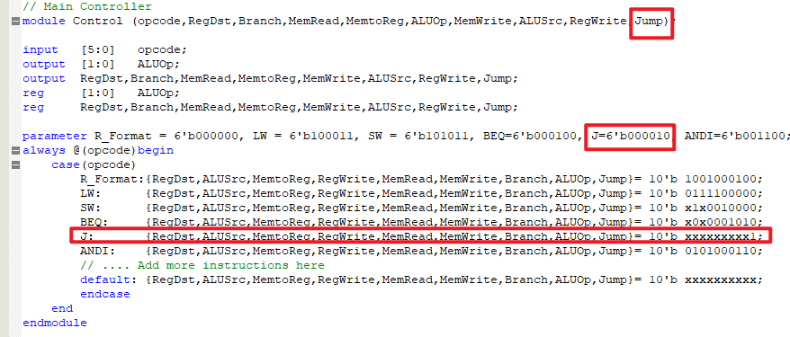
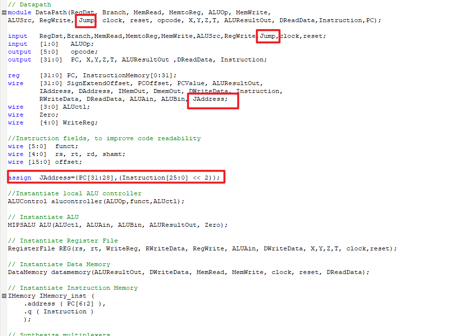

# EEE339 Assignment 2 Report

[toc]

## Q1, Q2 Write operations

The X, Y, Z, T should be output, so the simulation can display them.


| Index | Number |
| ----- | ------ |
| X     | 7      |
| Y     | 1      |
| Z     | 2      |
| T     | 3      |

Machine code: 

| Operations                                                   | Machine Code |
| ------------------------------------------------------------ | ------------ |
| Load the data stored in the X location of the data memory into the X registers | `8C070007`   |
| Load the data stored in the Y location of the data memory into the Y registers | `8C010001`   |
| Add the X and Y registers and store the result in the Z register | `00E11021`   |
| Store the data from the Z register into the Z memory location | `AC020002`   |
| Load the data in the Z memory location into the T register   | `8C060002`   |


##### Operation 1

Load the data stored in the **X** location of the data memory into the **X** registers. Machine code is: `8C070007`. 

The reasons:

1. *load* operation is `100011`. 
2. *base* is `00000`. 
3. *rt* is `00111` because the X register is 7.
4. *offset* is `00111`, because the X memory address is 7. 

|   LW   | base  |  rt   |      offset      |
| :----: | :---: | :---: | :--------------: |
| 100011 | 00000 | 00111 | 0000000000000111 |


##### Operation 2

Load the data stored in the **Y** location of the data memory into the **Y** registers. Machine code is: `8C010001`.

The reasons:

1. *load* operation is `100011`. 
2. *base* is `00000`. 
3. *rt* is `00001` because the Y register is 1.
4. *offset* is `00001`, because the Y memory address is 1. 

|   LW   | base  |  rt   |      offset      |
| :----: | :---: | :---: | :--------------: |
| 100011 | 00000 | 00001 | 0000000000000001 |


##### Operation 3

Add the **X** and **Y** registers and store the result in the **Z** register. Machine code is: `00E11020`.

The reasons:

1. *add* operation is `00000`. 
2. *rs* is `00111` because the X register is 7.
3. *rt* is `00001` because the Y register is 1.
4. *rd* is `00010` because the Z register is 2.

|  ADDU  |  rs   |  rt   |  rd   |       |        |
| :----: | :---: | :---: | :---: | :---: | :----: |
| 000000 | 00111 | 00001 | 00010 | 00000 | 100000 |


##### Operation 4

Store the data from the **Z** register into the **Z** memory location. Machine code is:`AC020002`.

The reasons:

1. *store* operation is `101011`. 
2. *base* is `00000`.
3. *rt* is `00010` because the Z register is 2.
4. *offset* is `0010` because the Z memory location is 2.

|   SW   | base  |  rt   |      offset      |
| :----: | :---: | :---: | :--------------: |
| 101011 | 00000 | 00010 | 0000000000000010 |


##### Operation 5

Load the data in the **Z** memory location into the **T** register. Machine code is: `8C030002`.

The reasons:

1. *Load* operation is `100011`. 
2. *base* is `00000`.
3. *rt* is `00011` because the T register is 3.
4. *offset* is `00010` because the Z memory position is 2.

|   LW   | base  |  rt   |      offset      |
| :----: | :---: | :---: | :--------------: |
| 100011 | 00000 | 00011 | 0000000000000010 |


And the machine code in *IMemory.mif* file is that:


## Simulation

Simulation waveforms for the PC, opcode, ALUResultOut, DReadData and relevant registers (X, Y, T) must be annotated. You should clearly indicate why the simulations show that the operation is correct or incorrect. 


### Prepare Work

Base on memory records in the `DataMemory` module, the records of memory position and data are shown as below.

| Memory Position |   Data   |
| :-------------: | :------: |
|    `DMem[0]`    | 00000005 |
|    `DMem[1]`    | 0000000A |
|    `DMem[2]`    | 00000055 |
|    `DMem[3]`    | 000000AA |
|    `DMem[4]`    | 00005555 |
|    `DMem[5]`    | 00008888 |
|    `DMem[6]`    | 00550000 |
|    `DMem[7]`    | 00004444 |

Therefore, the correct value for X, Y, Z, T should be:

| Register | Value    | Reason              |
| -------- | -------- | ------------------- |
| X        | 00004444 | `DMem[7]`           |
| Y        | 0000000A | `DMem[1]`           |
| Z        | 0000444E | `DMem[1] + DMem[7]` |
| T        | 0000444E | `DMem[1] + DMem[7]` |


The simulation clock settings:

1. *Period* is 50.0ns. If this period is too small, truncated would be appearance. The operation cannot perform completely (e.g. 20ns is too small).  
2. *Duty cycle* is 50%.
3. *Offset* is 0.


### Operation 1

At the first clock, load the data stored in the **X** location of the data memory into the **X** register. Simulation is shown as below.


1. *PC* is `0000004`, which is the next instruction memory position.
2. *ALUResultOut* is `0000007`, which is the memory position of `offset + base` equals to memory position of **X**. 
3. *X* is `00004444` is equals to the **X** data memory which it loads.
4. *Instruction* is `8C070007`.
5. *opcode* is 23, which is the load operation. 
5. *DReadData* is `00004444`, which is the X register value.


### Operation 2

At the second clock. Load the data stored in the **Y** location of the data memory into the **Y** register. Simulation is shown as below.


1. *PC* is `0000008`, which is the next instruction memory position.
2. *ALUResultOut* is `0000001`, which is the memory position of `offset + base` equals to memory position of **Y**. 
3. *Y* is `00004444` is equals to the **Y** data memory which it loads.
4. *Instruction* is `8C070007`. `00E11000` is the next instruction.
5. *opcode* is 23, which is the load operation. The following changes are transfer to next instruction.
5. *DReadData* is `0000444A`, which is the Y register value.


### Operation 3

At the third clock. Add the **X** and **Y** registers and store the result in the **Z** register. Machine code is: `00E11000`. Simulation is shown as below.


1. *PC* is `00000010c, which is the next instruction memory position.
2. *ALUResultOut* is `0000444E`, which is the result of `X+Y`.  
3. *Z* is `0000444E` is equals to the **X+Y** .
4. *Instruction* is `8C070007`. `AC020002` is loaded next instruction.
5. *opcode* is 0, which is the add operation. The following changes are transfer to next instruction.


### Operation 4

At the fourth clock. Store the data from the **Z** register into the **Z** memory location. Machine code is:`AC020002`. Simulation is shown as below.


1. *PC* is `00000010`, which is the next instruction memory position.
2. *ALUResultOut* is `00000002` is equals to `Z` register address.  
3. *Instruction* is `AC020002`. `8C030002` which is loaded next instruction.
4. *opcode* is 2B, which is the store operation. The following changes are transfer to next instruction.
5. *DReadData* is `0000444E`, which  is equals to `offset+base` value.  


### Operation 5

At the five clock. Load the data in the **Z** memory location into the **T** register. Machine code is: `8C030002`. Simulation is shown as below.


1. *PC* is `00000014`, which is the next instruction memory position.
2. *ALUResultOut* is `00000002` is equals to `offset+base` as well as the Z register position.  
3. *Instruction* is `8C030002`. `00000000` which is loaded next instruction. Because this is the last instruction.
4. *opcode* is 23, which is the load operation.
5. *DReadData* is `0000444E`, which is the data read from Z memory.


After five clock, the register results are as same as the expectation above.


## Q3. BEQ Instruction

The branch operation code is a I-format instruction. BEQ compare two values of register rs and rt. If the two values are equal, the offset will be shifted left 2 bit, expand to 32 bits and added into PC. 

| OP   | rs   | rt   | Offset |
| ---- | ---- | ---- | ------ |

The following content will be introduced by 2 parts, an established case and a not established case. To illustrate 


### Not Established Case 

The following case is a not established case. It compare X and Y registers, and if it is established, then PC add 4. As can be seen from the above, X and Y registers are not same value. Therefore, the PC will only added by 4.

| OP     | rs    | rt    | Offset           |
| ------ | ----- | ----- | ---------------- |
| 000100 | 00111 | 00001 | 0000000000000001 |

The machine code is `10E10001`.

The simulation result:


PC is added by 4, from `18` to `1c` not added by 8 (offset + 4). The `beq` condition is not establish.


### Established Case

The following case is an established case. It compare Z and T registers, and if it is established, then PC add 4. As can be seen from the above, Z and T register are same value. Therefore, the PC will be added by 8.

| OP     | rs    | rt    | Offset           |
| ------ | ----- | ----- | ---------------- |
| 000100 | 00010 | 00011 | 0000000000000001 |

The machine code is `10430001`.

The simulation result is shown as below.


The PC is added by 8, which means the `beq` condition is established. So, the `PC` is add offset and 4 which is 8.


## Q4. Jump

Because the provided code do not contains Jump operation. The **Control** and **DataPath** modules will be modified to support jump operation. The core changes are in the control module, which should add one output. If Jump is triggered, the address will be **shift left 2 bit and join the high 4 bit in PC**, then assigned to PC directly.

The operation of `Jump` could be introduced by Verilog, the main changes:

```verilog
assign JAddress={PC[31:28],(Instruction[25:0] << 2)};
// if Jump
assign	PCValue = (Branch & Zero ? PC+4+PCOffset : ((Jump) ? JAddress : PC+4);
// assign PCValue to PC
PC <= PCValue;
```

The details code will be shown in implementation. And to verify the correctness, the simulation will also provide.


### Implementation

In the **Control** module:



In the **DataPath** module:



The complete code in the appendix.


### Simulation

The `jump` operation belongs to J-format operation. And the opcode defined in module **Control** is given as `000010`. The following code will set the PC value to 0. 

The simulation instruction is following.

| OP     | ADDRESS                    |
| ------ | -------------------------- |
| 000010 | 00000000000000000000000000 |

Machine code is `0800 0000`. And add it to the `.mif` file.

The simulation result is shown as below.


When the instruction is `0800000`, PC from `0000 0010` to `0000 0000`. This simulation could verify the correct correctness.


## Q5, Q6. ANDI

My additional instruction is ANDI. It is an I-format instruction. The ALU should use AND operation, which is `0`, which is ALUCtl. 


And the ALUOp should be `11`.


The ANDI instruction is added in `Control` module.


### Simulation 

The machine code of the ANDI simulation is shown below. The operation of this instruction is that get result of rs (**Y** register) AND immediate Value to rt (register **Z**)   

| OP     | rs    | rt    | Immediate value  |
| ------ | ----- | ----- | ---------------- |
| 001100 | 00001 | 00010 | 0000000000001111 |

The machine code is `3022000F`.

Base on the result of simulation, the Z is finish the ANDI operation, which is get AND operation on F and A.


## Q7. Change data bus width to 28 bit width

Change all the *registers* and *data memory* from 32 bit width to 28 bit width.


This following figure is shown as the 28 bit width data bus. The operations are same as above.


The complete code is at Appendix.

### Operation 1

At the first clock, load the data stored in the ***\*X\**** location of the data memory into the ***\*X\**** register. Simulation is shown as below.


### Operation 2 

At the second clock. Load the data stored in the ***\*Y\**** location of the data memory into the ***\*Y\**** register. Simulation is shown as below.

### 


### Operation 3

At the third clock. Add the ***\*X\**** and ***\*Y\**** registers and store the result in the ***\*Z\**** register. Machine code is: `00E11000`. Simulation is shown as below.


### Operation 4 

At the fourth clock. Store the data from the ***\*Z\**** register into the ***\*Z\**** memory location. Machine code is:`AC020002`. Simulation is shown as below.


### Operation 5

At the five clock. Load the data in the ***\*Z\**** memory location into the ***\*T\**** register. Machine code is: `8C030002`. Simulation is shown as below.


## Appendix

### 32 bits

The complete code of 32 bit width version.

```verilog
// Register File
module RegisterFile (Read1,Read2,Writereg,WriteData,RegWrite,Data1,Data2,X,Y,Z,T,clock,reset);

	input 	[4:0] Read1,Read2,Writereg; // the registers numbers to read or write
	input 	[31:0] WriteData; 			// data to write
	input 	RegWrite; 					// The write control
	input 	clock, reset; 				// The clock to trigger writes
	output 	[31:0] Data1, Data2; 		// the register values read;
	output 	[31:0] X,Y,Z,T;
	reg 	[31:0] RF[31:0]; 			// 32 registers each 32 bits long
	integer	k;
	
	// Read from registers independent of clock	
	assign 	Data1 = RF[Read1];
	assign 	Data2 = RF[Read2]; 
	assign	X = RF[7];
	assign	Y = RF[1];
	assign	Z = RF[2];
	assign	T = RF[3];
	// write the register with new value on the falling edge of the clock if RegWrite is high
	always @(posedge clock or posedge reset)
		if (reset) for(k=0;k<32;k=k+1) RF[k]<=32'h00000000;
		// Register 0 is a read only register with the content of 0
		else	if (RegWrite & (Writereg!=0)) RF[Writereg] <= WriteData;
endmodule

//ALU Control 
module ALUControl (ALUOp, FuncCode, ALUCtl);

	input 	[1:0] 	ALUOp;
	input 	[5:0] 	FuncCode;
	output	[3:0]	ALUCtl;
	reg		[3:0]	ALUCtl;
	
	always@( ALUOp, FuncCode)
	begin
	case(ALUOp)
	2'b00:	ALUCtl = 4'b0010;
	2'b01:	ALUCtl = 4'b0110;
	2'b10:	case(FuncCode)
				6'b 100000: ALUCtl = 4'b0010;
				6'b 100010: ALUCtl = 4'b0110;
				6'b 100100: ALUCtl = 4'b0000;
				6'b 100101: ALUCtl = 4'b0001;
				6'b 101010: ALUCtl = 4'b0111;
				default:	ALUCtl = 4'bxxxx;
			endcase	
	2'b11:	ALUCtl = 4'b0000;
	default:ALUCtl = 4'bxxxx;
	endcase
	end
endmodule

//ALU
module MIPSALU (ALUctl, A, B, ALUOut, Zero);
	input	[3:0] 	ALUctl;
	input	[31:0] 	A,B;
	output	[31:0] 	ALUOut;
	output 	Zero;
	reg		[31:0] ALUOut;
	
	assign Zero = (ALUOut==0); //Zero is true if ALUOut is 0
	always @(ALUctl, A, B) begin //reevaluate if these change
	case (ALUctl)
		0: ALUOut <= A & B;
		1: ALUOut <= A | B;
		2: ALUOut <= A + B;
		6: ALUOut <= A - B;
		7: ALUOut <= A < B ? 1:0;
		// .... Add more ALU operations here
		default: ALUOut <= A; 
		endcase
	end
endmodule

// Data Memory
module DataMemory(Address, DWriteData, MemRead, MemWrite, clock, reset, DReadData);
input 	[31:0] 	Address, DWriteData;
input			MemRead, MemWrite, clock, reset;
output 	[31:0]	DReadData;
reg		[31:0] 	DMem[7:0];	

assign  DReadData = DMem[Address[2:0]];
always @(posedge clock or posedge reset)begin
		if (reset) begin
			DMem[0]=32'h00000005;
			DMem[1]=32'h0000000A;
			DMem[2]=32'h00000055;
			DMem[3]=32'h000000AA;
			DMem[4]=32'h00005555;
			DMem[5]=32'h00008888;
			DMem[6]=32'h00550000;
			DMem[7]=32'h00004444;
			end else
			if (MemWrite) DMem[Address[2:0]] <= DWriteData;
		end
endmodule

// Main Controller
module Control (opcode,RegDst,Branch,MemRead,MemtoReg,ALUOp,MemWrite,ALUSrc,RegWrite,Jump);

input 	[5:0] 	opcode;
output	[1:0] 	ALUOp;
output	RegDst,Branch,MemRead,MemtoReg,MemWrite,ALUSrc,RegWrite,Jump;
reg		[1:0]	ALUOp;
reg 	RegDst,Branch,MemRead,MemtoReg,MemWrite,ALUSrc,RegWrite,Jump;

parameter R_Format = 6'b000000, LW = 6'b100011, SW = 6'b101011, BEQ=6'b000100, J=6'b000010, ANDI=6'b001100;
always @(opcode)begin
	case(opcode)
		R_Format:{RegDst,ALUSrc,MemtoReg,RegWrite,MemRead,MemWrite,Branch,ALUOp,Jump}= 10'b 1001000100;
		LW: 	 {RegDst,ALUSrc,MemtoReg,RegWrite,MemRead,MemWrite,Branch,ALUOp,Jump}= 10'b 0111100000;
		SW: 	 {RegDst,ALUSrc,MemtoReg,RegWrite,MemRead,MemWrite,Branch,ALUOp,Jump}= 10'b x1x0010000;
		BEQ:	 {RegDst,ALUSrc,MemtoReg,RegWrite,MemRead,MemWrite,Branch,ALUOp,Jump}= 10'b x0x0001010;
		J:		 {RegDst,ALUSrc,MemtoReg,RegWrite,MemRead,MemWrite,Branch,ALUOp,Jump}= 10'b xxxxxxxxx1;
		ANDI:	 {RegDst,ALUSrc,MemtoReg,RegWrite,MemRead,MemWrite,Branch,ALUOp,Jump}= 10'b 0101000110; 
		// .... Add more instructions here
		default: {RegDst,ALUSrc,MemtoReg,RegWrite,MemRead,MemWrite,Branch,ALUOp,Jump}= 10'b xxxxxxxxxx;
		endcase
	end
endmodule 

// Datapath
module DataPath(RegDst, Branch, MemRead, MemtoReg, ALUOp, MemWrite,
ALUSrc, RegWrite, Jump, clock, reset, opcode, X,Y,Z,T, ALUResultOut, DReadData,Instruction,PC);

input 	RegDst,Branch,MemRead,MemtoReg,MemWrite,ALUSrc,RegWrite,Jump,clock,reset;
input 	[1:0] 	ALUOp;
output 	[5:0] 	opcode;
output	[31:0]	PC, X,Y,Z,T, ALUResultOut ,DReadData, Instruction;

reg 	[31:0] PC, InstructionMemory[0:31];
wire 	[31:0] SignExtendOffset, PCOffset, PCValue, ALUResultOut,
		IAddress, DAddress, IMemOut, DmemOut, DWriteData, Instruction,
		RWriteData, DReadData, ALUAin, ALUBin, JAddress;
wire 	[3:0] ALUctl;
wire 	Zero;
wire 	[4:0] WriteReg;

//Instruction fields, to improve code readability
wire [5:0] 	funct;
wire [4:0] 	rs, rt, rd, shamt;
wire [15:0] offset;

assign	JAddress={PC[31:28],(Instruction[25:0] << 2)};

//Instantiate local ALU controller
ALUControl alucontroller(ALUOp,funct,ALUctl);

// Instantiate ALU
MIPSALU ALU(ALUctl, ALUAin, ALUBin, ALUResultOut, Zero);

// Instantiate Register File
RegisterFile REG(rs, rt, WriteReg, RWriteData, RegWrite, ALUAin, DWriteData, X,Y,Z,T, clock,reset);

// Instantiate Data Memory
DataMemory datamemory(ALUResultOut, DWriteData, MemRead, MemWrite, clock, reset, DReadData);

// Instantiate Instruction Memory
IMemory IMemory_inst (
	.address ( PC[6:2] ),
	.q ( Instruction )
	);
	  
// Synthesize multiplexers
assign 	WriteReg	= (RegDst)			? rd 				: rt;
assign	ALUBin		= (ALUSrc) 			? SignExtendOffset 	: DWriteData;
assign	PCValue		= (Branch & Zero)	? PC+4+PCOffset 	: ((Jump)		? JAddress	: PC+4);
assign	RWriteData 	= (MemtoReg)		? DReadData			: ALUResultOut;	

// Acquire the fields of the R_Format Instruction for clarity	
assign {opcode, rs, rt, rd, shamt, funct} = Instruction;
// Acquire the immediate field of the I_Format instructions
assign offset = Instruction[15:0];
//sign-extend lower 16 bits
assign SignExtendOffset = { {16{offset[15]}} , offset[15:0]};
// Multiply by 4 the PC offset
assign PCOffset = SignExtendOffset << 2;
// Write the address of the next instruction into the program counter 
always @(posedge clock ) begin
if (reset) PC<=32'h00000000; else
	PC <= PCValue;
end
endmodule

module MIPS1CYCLE(clock, reset,opcode, ALUResultOut ,DReadData, X,Y,Z,T,Instruction,PC);
	input 	clock, 	reset;
	output	[5:0] 	opcode;
	output	[31:0]	ALUResultOut ,DReadData; // For simulation purposes
	output	[31:0]	PC,X,Y,Z,T;
	output	[31:0]	Instruction;
	
	wire [1:0] ALUOp;
	wire [5:0] opcode;
	wire [31:0] SignExtend,ALUResultOut ,DReadData,Instruction;
	wire RegDst,Branch,MemRead,MemtoReg,MemWrite,ALUSrc,RegWrite;

	// Instantiate the Datapath
	DataPath MIPSDP (RegDst,Branch,MemRead,MemtoReg,ALUOp,
	MemWrite,ALUSrc,RegWrite,Jump,clock, reset, opcode, X,Y,Z,T, ALUResultOut ,DReadData,Instruction,PC);

	//Instantiate the combinational control unit
	Control MIPSControl (opcode,RegDst,Branch,MemRead,MemtoReg,ALUOp,MemWrite,ALUSrc,RegWrite,Jump);
endmodule

```


### 28 bit 

The complete code of 28 bit width version.

```verilog
// MIPS single Cycle processor originaly developed for simulation by Patterson and Hennesy
// Modified for synthesis using the QuartusII package by Dr. S. Ami-Nejad. Feb. 2009 

// Register File
module RegisterFile (Read1,Read2,Writereg,WriteData,RegWrite,Data1,Data2,X,Y,Z,T,clock,reset);

	input 	[4:0] Read1,Read2,Writereg; // the registers numbers to read or write
	input 	[27:0] WriteData; 			// data to write
	input 	RegWrite; 					// The write control
	input 	clock, reset; 				// The clock to trigger writes
	output 	[27:0] Data1, Data2; 		// the register values read;
	output 	[27:0] X,Y,Z,T;
	reg 	[31:0] RF[27:0]; 			// 32 registers each 28 bits long
	integer	k;
	
	// Read from registers independent of clock	
	assign 	Data1 = RF[Read1];
	assign 	Data2 = RF[Read2]; 
	assign	X = RF[7];
	assign	Y = RF[1];
	assign	Z = RF[2];
	assign	T = RF[3];
	// write the register with new value on the falling edge of the clock if RegWrite is high
	always @(posedge clock or posedge reset)
		if (reset) for(k=0;k<28;k=k+1) RF[k]<=28'h00000000;
		// Register 0 is a read only register with the content of 0
		else	if (RegWrite & (Writereg!=0)) RF[Writereg] <= WriteData;
endmodule

//ALU Control 
module ALUControl (ALUOp, FuncCode, ALUCtl);

	input 	[1:0] 	ALUOp;
	input 	[5:0] 	FuncCode;
	output	[3:0]	ALUCtl;
	reg		[3:0]	ALUCtl;
	
	always@( ALUOp, FuncCode)
	begin
	case(ALUOp)
	2'b00:	ALUCtl = 4'b0010;
	2'b01:	ALUCtl = 4'b0110;
	2'b10:	case(FuncCode)
				6'b 100000: ALUCtl = 4'b0010;
				6'b 100010: ALUCtl = 4'b0110;
				6'b 100100: ALUCtl = 4'b0000;
				6'b 100101: ALUCtl = 4'b0001;
				6'b 101010: ALUCtl = 4'b0111;
				default:	ALUCtl = 4'bxxxx;
			endcase	
	2'b11:	ALUCtl = 4'b0000;
	default:ALUCtl = 4'bxxxx;
	endcase
	end
endmodule

//ALU
module MIPSALU (ALUctl, A, B, ALUOut, Zero);
	input	[3:0] 	ALUctl;
	input	[27:0] 	A,B;
	output	[27:0] 	ALUOut;
	output 	Zero;
	reg		[27:0] ALUOut;
	
	assign Zero = (ALUOut==0); //Zero is true if ALUOut is 0
	always @(ALUctl, A, B) begin //reevaluate if these change
	case (ALUctl)
		0: ALUOut <= A & B;
		1: ALUOut <= A | B;
		2: ALUOut <= A + B;
		6: ALUOut <= A - B;
		7: ALUOut <= A < B ? 1:0;
		// .... Add more ALU operations here
		default: ALUOut <= A; 
		endcase
	end
endmodule

// Data Memory
module DataMemory(Address, DWriteData, MemRead, MemWrite, clock, reset, DReadData);
input 	[27:0] 	Address, DWriteData;
input			MemRead, MemWrite, clock, reset;
output 	[27:0]	DReadData;
reg		[27:0] 	DMem[7:0];	

assign  DReadData = DMem[Address[2:0]];
always @(posedge clock or posedge reset)begin
		if (reset) begin
			DMem[0]=28'h00000005;
			DMem[1]=28'h0000000A;
			DMem[2]=28'h00000055;
			DMem[3]=28'h000000AA;
			DMem[4]=28'h00005555;
			DMem[5]=28'h00008888;
			DMem[6]=28'h00550000;
			DMem[7]=28'h00004444;
			end else
			if (MemWrite) DMem[Address[2:0]] <= DWriteData;
		end
endmodule

// Main Controller
module Control (opcode,RegDst,Branch,MemRead,MemtoReg,ALUOp,MemWrite,ALUSrc,RegWrite,Jump);

input 	[5:0] 	opcode;
output	[1:0] 	ALUOp;
output	RegDst,Branch,MemRead,MemtoReg,MemWrite,ALUSrc,RegWrite,Jump;
reg		[1:0]	ALUOp;
reg 	RegDst,Branch,MemRead,MemtoReg,MemWrite,ALUSrc,RegWrite,Jump;

parameter R_Format = 6'b000000, LW = 6'b100011, SW = 6'b101011, BEQ=6'b000100, J=6'b000010, ANDI=6'b001100;
always @(opcode)begin
	case(opcode)
		R_Format:{RegDst,ALUSrc,MemtoReg,RegWrite,MemRead,MemWrite,Branch,ALUOp,Jump}= 10'b 1001000100;
		LW: 	 {RegDst,ALUSrc,MemtoReg,RegWrite,MemRead,MemWrite,Branch,ALUOp,Jump}= 10'b 0111100000;
		SW: 	 {RegDst,ALUSrc,MemtoReg,RegWrite,MemRead,MemWrite,Branch,ALUOp,Jump}= 10'b x1x0010000;
		BEQ:	 {RegDst,ALUSrc,MemtoReg,RegWrite,MemRead,MemWrite,Branch,ALUOp,Jump}= 10'b x0x0001010;
		J:		 {RegDst,ALUSrc,MemtoReg,RegWrite,MemRead,MemWrite,Branch,ALUOp,Jump}= 10'b xxxxxxxxx1;
		ANDI:	 {RegDst,ALUSrc,MemtoReg,RegWrite,MemRead,MemWrite,Branch,ALUOp,Jump}= 10'b 0101000110; 
		// .... Add more instructions here
		default: {RegDst,ALUSrc,MemtoReg,RegWrite,MemRead,MemWrite,Branch,ALUOp,Jump}= 10'b xxxxxxxxxx;
		endcase
	end
endmodule 

// Datapath
module DataPath(RegDst, Branch, MemRead, MemtoReg, ALUOp, MemWrite,
ALUSrc, RegWrite, Jump, clock, reset, opcode, X,Y,Z,T, ALUResultOut, DReadData,Instruction,PC);

input 	RegDst,Branch,MemRead,MemtoReg,MemWrite,ALUSrc,RegWrite,Jump,clock,reset;
input 	[1:0] 	ALUOp;
output 	[5:0] 	opcode;
output	[27:0]	X,Y,Z,T, ALUResultOut ,DReadData;
output	[31:0]	PC, Instruction;
reg 	[31:0] PC, InstructionMemory[0:31];
wire 	[31:0] JAddress;
wire 	[27:0] SignExtendOffset, PCOffset, PCValue, ALUResultOut,
		IAddress, DAddress, IMemOut, DmemOut, DWriteData,
		RWriteData, DReadData, ALUAin, ALUBin;
wire 	[3:0] ALUctl;
wire 	Zero;
wire 	[4:0] WriteReg;

//Instruction fields, to improve code readability
wire [5:0] 	funct;
wire [4:0] 	rs, rt, rd, shamt;
wire [15:0] offset;

assign	JAddress={PC[31:28],(Instruction[25:0] << 2)};

//Instantiate local ALU controller
ALUControl alucontroller(ALUOp,funct,ALUctl);

// Instantiate ALU
MIPSALU ALU(ALUctl, ALUAin, ALUBin, ALUResultOut, Zero);

// Instantiate Register File
RegisterFile REG(rs, rt, WriteReg, RWriteData, RegWrite, ALUAin, DWriteData, X,Y,Z,T, clock,reset);

// Instantiate Data Memory
DataMemory datamemory(ALUResultOut, DWriteData, MemRead, MemWrite, clock, reset, DReadData);

// Instantiate Instruction Memory
IMemory IMemory_inst (
	.address ( PC[6:2] ),
	.q ( Instruction )
	);
	  
// Synthesize multiplexers
assign 	WriteReg	= (RegDst)			? rd 				: rt;
assign	ALUBin		= (ALUSrc) 			? SignExtendOffset 	: DWriteData;
assign	PCValue		= (Branch & Zero)	? PC+4+PCOffset 	: ((Jump)		? JAddress	: PC+4);
assign	RWriteData 	= (MemtoReg)		? DReadData			: ALUResultOut;	

// Acquire the fields of the R_Format Instruction for clarity	
assign {opcode, rs, rt, rd, shamt, funct} = Instruction;
// Acquire the immediate field of the I_Format instructions
assign offset = Instruction[15:0];
//sign-extend lower 16 bits
assign SignExtendOffset = { {16{offset[15]}} , offset[15:0]};
// Multiply by 4 the PC offset
assign PCOffset = SignExtendOffset << 2;
// Write the address of the next instruction into the program counter 
always @(posedge clock ) begin
if (reset) PC<=32'h00000000; else
	PC <= PCValue;
end
endmodule

module MIPS1CYCLE(clock, reset,opcode, ALUResultOut ,DReadData, X,Y,Z,T,Instruction,PC);
	input 	clock, 	reset;
	output	[5:0] 	opcode;
	output	[27:0]	ALUResultOut ,DReadData; // For simulation purposes
	output	[27:0]	X,Y,Z,T;
	output	[31:0]	PC;
	output	[31:0]	Instruction;
	
	wire [1:0] ALUOp;
	wire [5:0] opcode;
	wire [27:0] SignExtend,ALUResultOut, Instruction;
	wire RegDst,Branch,MemRead,MemtoReg,MemWrite,ALUSrc,RegWrite;

	// Instantiate the Datapath
	DataPath MIPSDP (RegDst,Branch,MemRead,MemtoReg,ALUOp,
	MemWrite,ALUSrc,RegWrite,Jump,clock, reset, opcode, X,Y,Z,T, ALUResultOut ,DReadData,Instruction,PC);

	//Instantiate the combinational control unit
	Control MIPSControl (opcode,RegDst,Branch,MemRead,MemtoReg,ALUOp,MemWrite,ALUSrc,RegWrite,Jump);
endmodule

```

